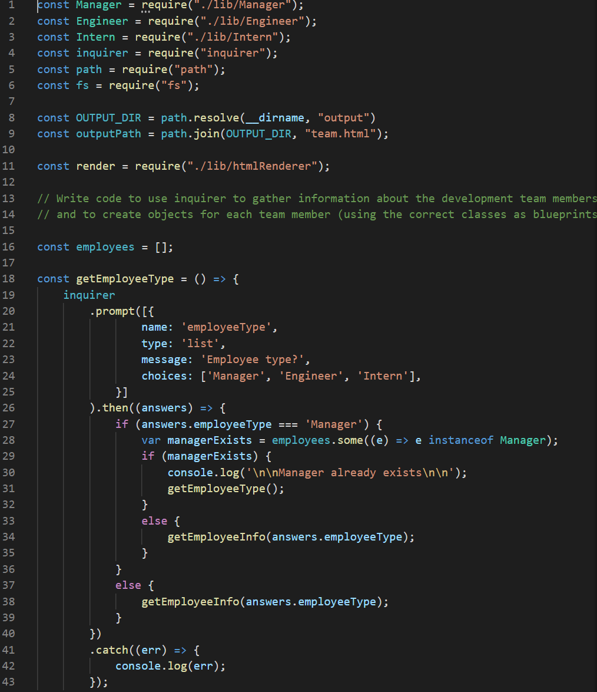
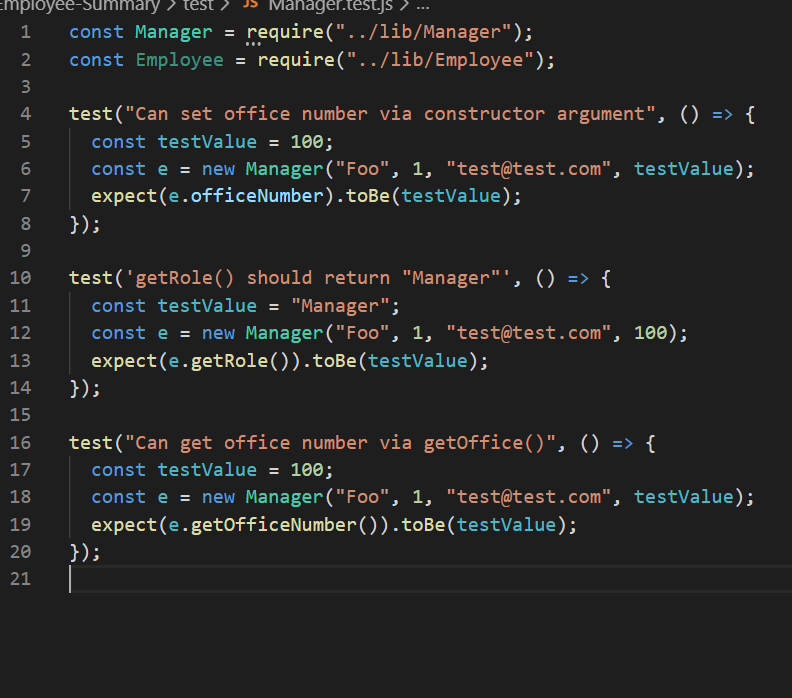

# Employee-Summary #

## About The Page ## 

 The application prompts the user for information about the team manager and then information about the team members. The user can input any number of team members, and they may be a mix of engineers and interns. This tasks passes all unit tests. When the user has completed building the team, the application creates a HTML file that displays a nicely formatted team roster based on the information provided by the user.
 
##  HTML template ##

Below are screenshots of my page and code for review:

### Screenshot of the app.js ###

### Screenshot of a sample test.js ###

## Built With ##

    Node 
    Express
    HTML 
    CSS 
    Bootstrap
    VS Code

### Installation ###

    Clone the repo

git clone https://github.com/Mitchelle-B/repo.git

## Contributing ##

    Fork the Project
    Create your Feature Branch (git checkout -b feature/AmazingFeature)
    Commit your Changes (git commit -m 'Add some AmazingFeature')
    Push to the Branch (git push origin feature/AmazingFeature)
    Open a Pull Request

## License ##

Distributed under the MIT License. See LICENSE for more information.
Contact

Project Link: https://github.com/Mitchelle-B/repo

## Acknowledgements ##

UWA Coding Bootcamp 